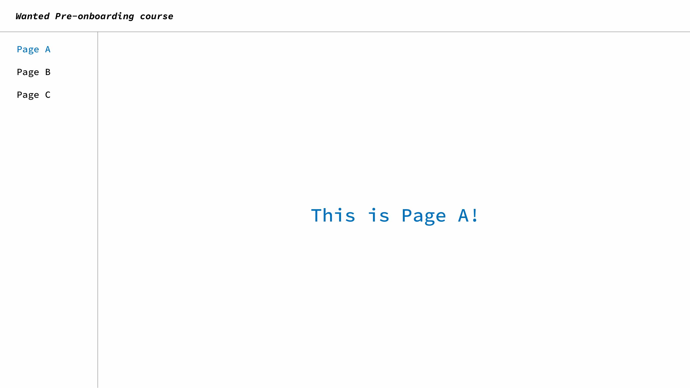

# 3월 원티드 프리온보딩 프론트엔드 과정 사전과제

## **🎯[과제 미션](./docs/)**

 

## **📝 기능 구현 목록**

### **✅ 1:: 레이아웃 구성하기**

- [x] 모든 페이지에 공통으로 반복되는 헤더와 사이드바가 있도록 구성한다.
- [x] 최소 3개 이상의 페이지를 가지도록 구현한다.

### **✅ 2:: 로그인 페이지**

- [x] 유저네임과 비밀번호를 받아 로그인을 수행할 수 있는 페이지를 만들어 보세요.
- [x] 단, 로그인 페이지는 공통 레이아웃(상단 네비게이션 바 및 사이드바)이 적용되지 않도록 만들어 주세요.
- [x] 페이지별로 로그인 여부를 판단할 수 있어야 한다.
