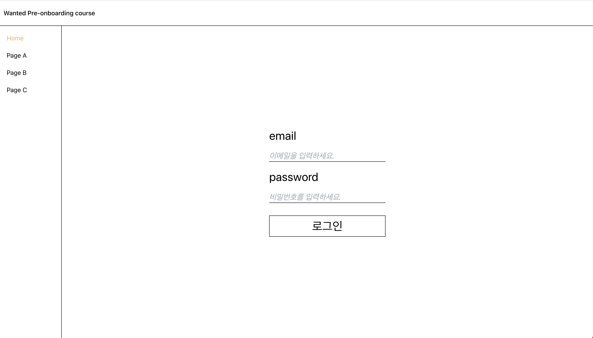

# 3월 원티드 프리온보딩 프론트엔드 과정 사전과제

[사전과제](https://flourishing-dragon-846989.netlify.app)

### 필수 구현

- [x] NextJS 등의 SSR 어플리케이션이 아닌, CSR 어플리케이션을 구축한다.
- [x] 최소 3개 이상의 페이지를 가지도록 구현한다.
- [x] 모든 페이지에 공통으로 반복되는 헤더와 사이드바가 있도록 구성한다.

### 추가 구현

- [x] 로그인을 수행할 수 있는 페이지

