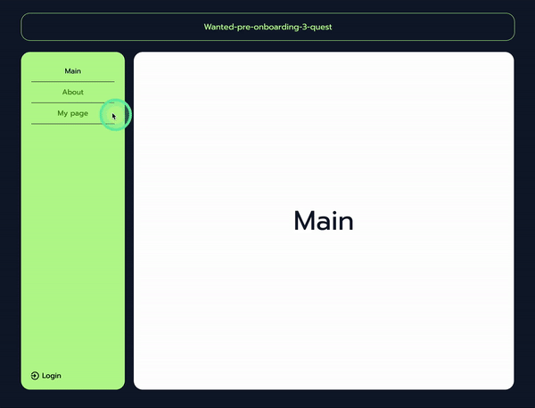
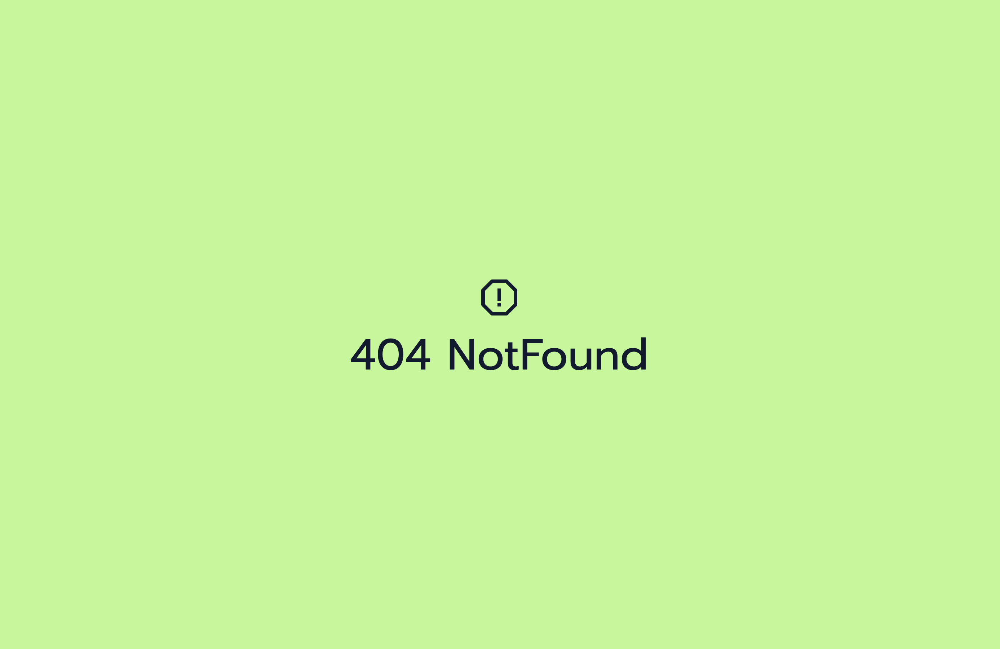

# 3월 원티드 프리온보딩 프론트엔드 과정 사전과제

### 🐭 만들어야 할 것

- NextJS 등의 SSR 어플리케이션이 아닌, CSR 어플리케이션을 구축한다. 
- 최소 3개 이상의 페이지를 가지도록 구현한다. 
- 모든 페이지에 공통으로 반복되는 헤더와 사이드바가 있도록 구성한다. 
- 3개의 페이지가 고정되는 앱이 아니라, 여러 개의 페이지가 언제든 추가될 수 있다고 생각하고 프로젝트를 수행해 보세요. 
- 만들어진 페이지별로 로그인 여부를 판단하고자 한다면 어떻게 구조를 확장해야할지 고민해 보세요. 

### 🐭 구현 내용

- recoil, recoil persist 사용하여 로그인 상태 관리
- 로그인 여부에 따라 login/logout 변경
- 사이드바의 메뉴 이름대로 path 이동
