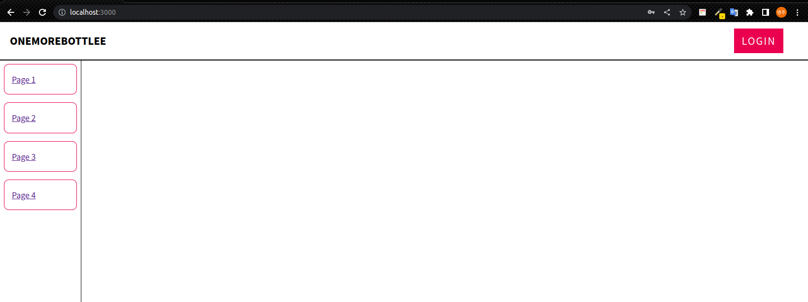
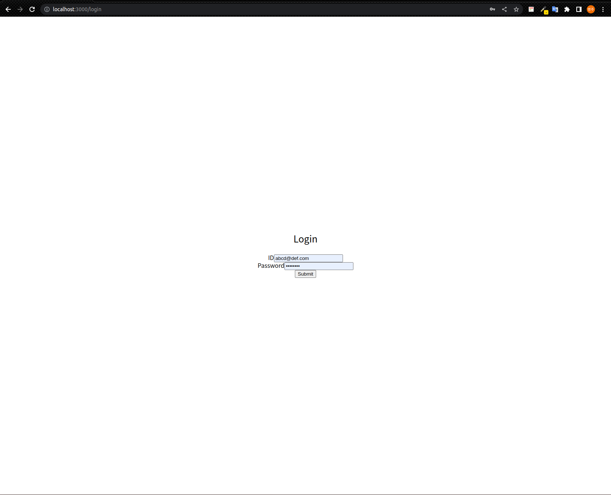

# **원티드 3월 챌린지**

## **230225 사전 과제**

### **과제**

- [x] CSR 어플리케이션 구축
- [x] 최소 3개 이상의 페이지 가지도록 구현
- [x] 모든 페이지에 공통으로 반복되는 헤더와 사이드바 구성
- [x] 로그인 페이지 만들기 
- [x] 공통 레이아웃(상단 네비게이션 바 및 사이드바)이 적용되지 않도록 만들기
- [x] 페이지 고정이 아닌, 페이지가 언제든 추가될 수 있다고 생각하기
- [] 페이지별로 로그인 여부를 판단한다면 어떻게 구조를 확장할지 고민하기
    - 새로운 페이지가 렌더링 될 때 확인하거나
    - 이동할때 헤더에서 확인하면 되지 않을까?

### **파일 트리**

📦src  
 ┣ 📂component  
 ┃ ┣ 📂Common  
 ┃ ┃ ┣ 📜Header.tsx  
 ┃ ┃ ┣ 📜Nav.tsx  
 ┃ ┃ ┗ 📜Navigation.tsx  
 ┃ ┗ 📂Page  
 ┃ ┃ ┣ 📜Login.tsx  
 ┃ ┃ ┣ 📜Page1.tsx  
 ┃ ┃ ┣ 📜Page2.tsx  
 ┃ ┃ ┣ 📜Page3.tsx  
 ┃ ┃ ┗ 📜Page4.tsx  
 ┣ 📂routes  
 ┃ ┗ 📜AppRouter.tsx  
 ┣ 📂style  
 ┃ ┣ 📜App.css  
 ┃ ┗ 📜index.css  
 ┣ 📜App.tsx  
 ┗ 📜index.tsx  

 파일 구조를 어떻게 해야할지 감이 안잡힌다. 더 좋은 방법을 고민해봐야겠다.

 ### **구현 화면**

|메인페이지|1번페이지|로그인페이지|
|:---:|:---:|:---:|
||||

### 느낀점

뭔가 많이 부족한 것 같다. 구현에만 치중한 결과물. 조금 더 생각하고 코드를 작성해야하지 않았을까하는 생각이 든다. 시간 여유가 생길때마다 조금씩 보완해야겠다.
