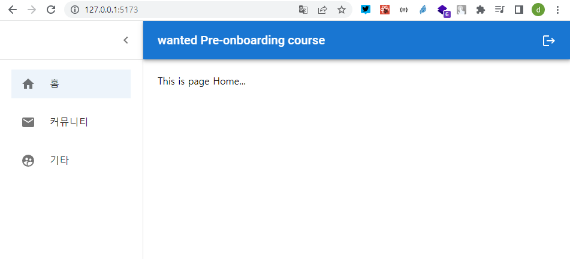

## 3월 원티드 프리온보딩 프론트엔드 과정 사전과제

<div>


</div>

### 레이아웃 패턴과 로그인

- 주요 포인트: 리액트 라우터 구성 및 레이아웃 구성

- [x] NextJS 등의 SSR 어플리케이션이 아닌, CSR 어플리케이션을 구축한다.
- [x] 최소 3개 이상의 페이지를 가지도록 구현한다.
      
      
      
      
- [x] 모든 페이지에 공통으로 반복되는 헤더와 사이드바가 있도록 구성한다.
- [x] 3개의 페이지가 고정되는 앱이 아니라, 여러 개의 페이지가 언제든 추가될 수 있다고 생각하고 프로젝트를 수행해 보세요.
- [x] 만들어진 페이지별로 로그인 여부를 판단하고자 한다면 어떻게 구조를 확장해야할지 고민해 보세요.
- [x] 추가로, 여유가 있다면 유저네임과 비밀번호를 받아 로그인을 수행할 수 있는 페이지를 만들어 보세요. 실제 API는 연결하지 않아도 되며, 로그인 페이지는 공통 레이아웃(상단 네비게이션 바 및 사이드바)이 적용되지 않도록 만들어 주세요.

### Getting Started

0. 클론 설치

```bash
~/workspace > git clone https://github.com/uhgenie7/wanted-pre-onboarding-3-FE-quest.git
```

1. 클라이언트

```bash
~/workspace > cd wanted-pre-onboarding-3-FE-quest
~/workspace/wanted-pre-onboarding-3-FE-quest > yarn && yarn build && yarn preview
```

2. 접속

```
http://127.0.0.1:4173/auth/login
```
